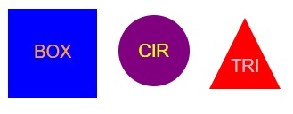

# logo-generator

## Description
This program allows users to create simple shapes with up to three letters inside in the user's color of choice.

Link to video demo: https://drive.google.com/file/d/11oCL6nnq2Uz94WJnNGEn6d2GcBxkfCgU/view?usp=sharing

## Installation
This program uses inquirer@8.2.4.

In the console run npm i to install all relevant dependencies

## Usage
Use this program to dynamically create simple logos for any project. 

## Contributors
Ethan Stone

## License
N/A